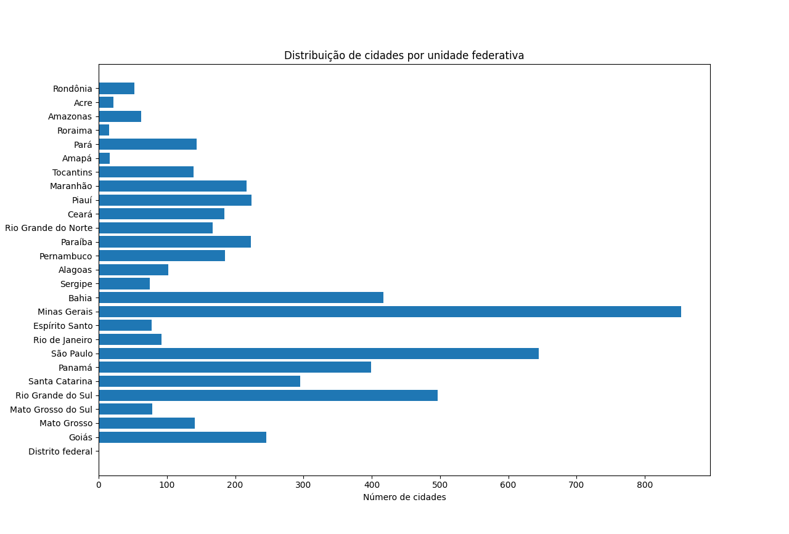
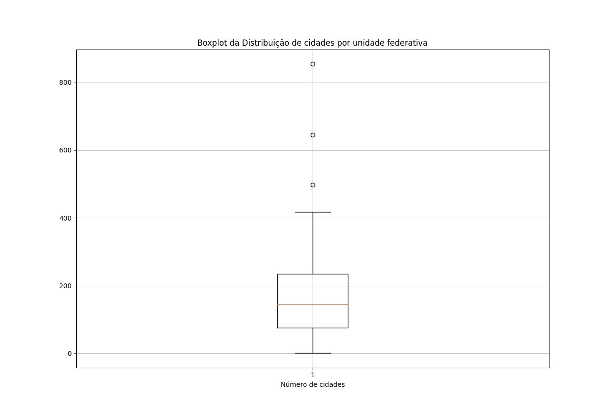

<h1 align="center"> Análise Estatística </h1> 

  
  

Média: 206.30 
Mediana: 141.00
Moda: 52.00                                                                                                    
Variância: 39608.80 
Desvio padrão: 199.02 |                                                                                                      

| Mínimo: 1 | Q1: 68.5 | Q2: 141 | Q3: 223 | Máximo: 853 |                                                                                           
                                                                                                                                                     
|Classe |  Frequência  |                                                                                                                             
|001-122| 11 (40.741%) |                                                                                                                             
|123-244|  9 (33.333%) |                                                                                                                             
|245-366|  2 ( 7.407%) |                                                                                                                             
|367-488|  2 ( 7.407%) |                                                                                                                             
|489-610|  1 ( 3.704%) |                                                                                                                             
|611-732|  1 ( 3.704%) |                                                                                                                             
|733-855|  1 ( 3.704%) |              

